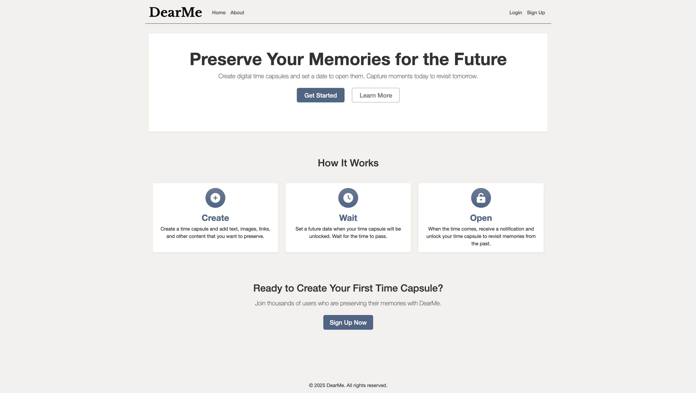
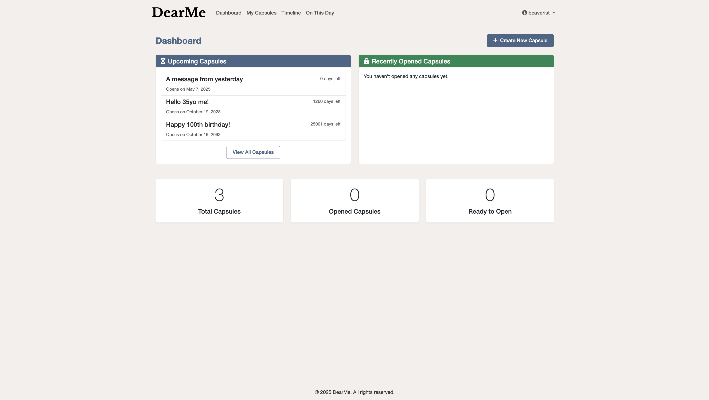
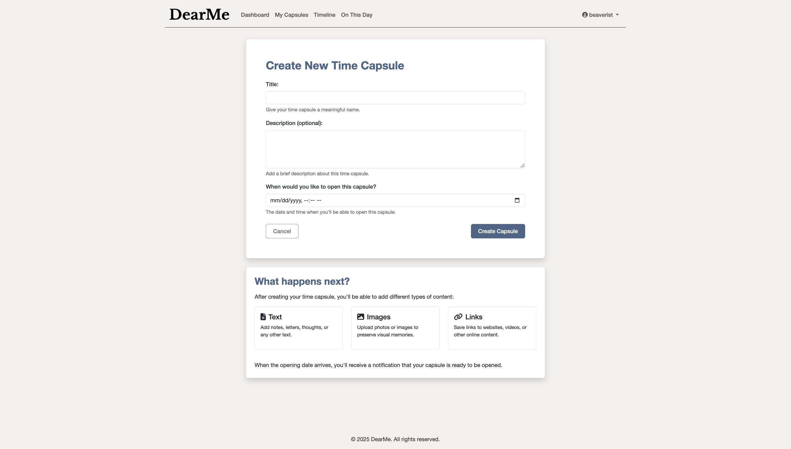
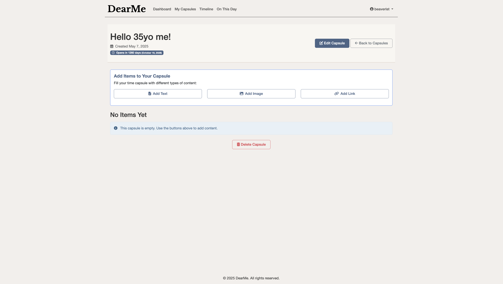
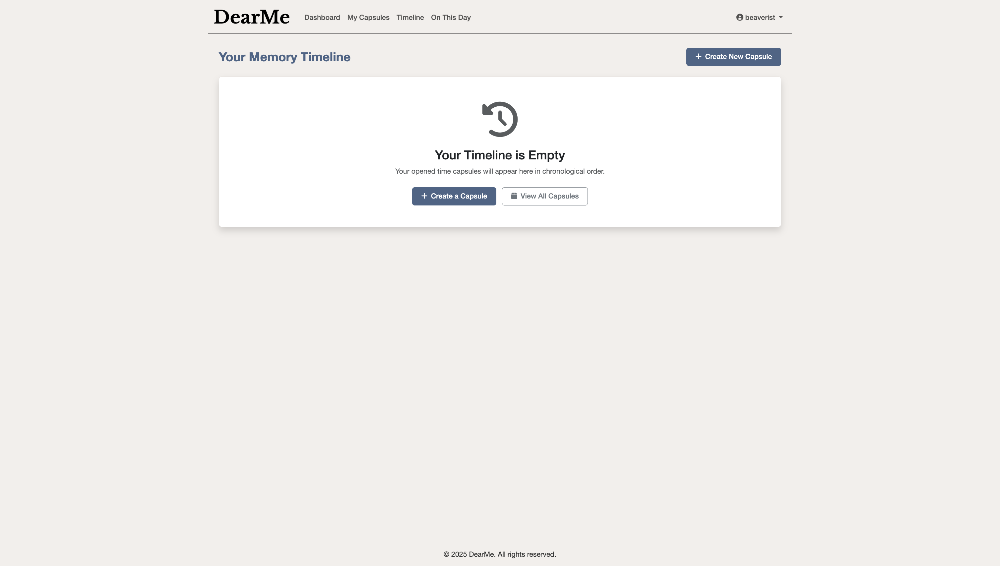
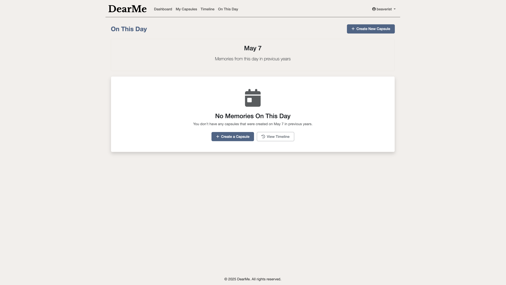

# DearMe

DearMe is a digital time capsule application that allows users to create messages, memories, and mementos for their future selves. Users can record thoughts, upload images, save links, and add other personal content to capsules that will be "locked" until a future date of their choosing. When that date arrives, the capsule becomes available to open, allowing users to rediscover their past thoughts, goals, and memories.

[Deployed Site](https://dearme-a9f3f088e1a2.herokuapp.com/)

## Screenshots

## Planning Materials

[Trello](https://trello.com/b/EvpHIfHZ/dearme-digital-time-capsule)

## Attributions

To be updated...

## Features

- **User Authentication**: Sign up, log in, and manage your user profile
- **Time Capsules**: Create, edit, and manage your digital time capsules
- **Multiple Item Types**: Add text, images, and links to your time capsules
- **Future Opening**: Set a date in the future when your capsule can be opened
- **Dashboard**: See your upcoming, ready-to-open, and opened capsules
- **Timeline**: View a chronological timeline of your opened capsules
- **On This Day**: Discover capsules you created on this day in previous years

## Technologies

- **Backend**: Django 5.2, Python
- **Database**: PostgreSQL
- **Frontend**: HTML5, CSS3, JavaScript, Bootstrap 5

## Next Steps

- **Email Notifications**: Implement email notifications for capsule opening dates
- **Social Sharing**: Add ability to share capsule contents on social media
- **Mobile App**: Develop a companion mobile application
- **Advanced Search**: Implement full-text search across capsule contents
- **Export Feature**: Allow users to export their capsule contents
- **Theme Customization**: Add more color themes and customization options
- **Analytics**: Add user engagement and capsule statistics
